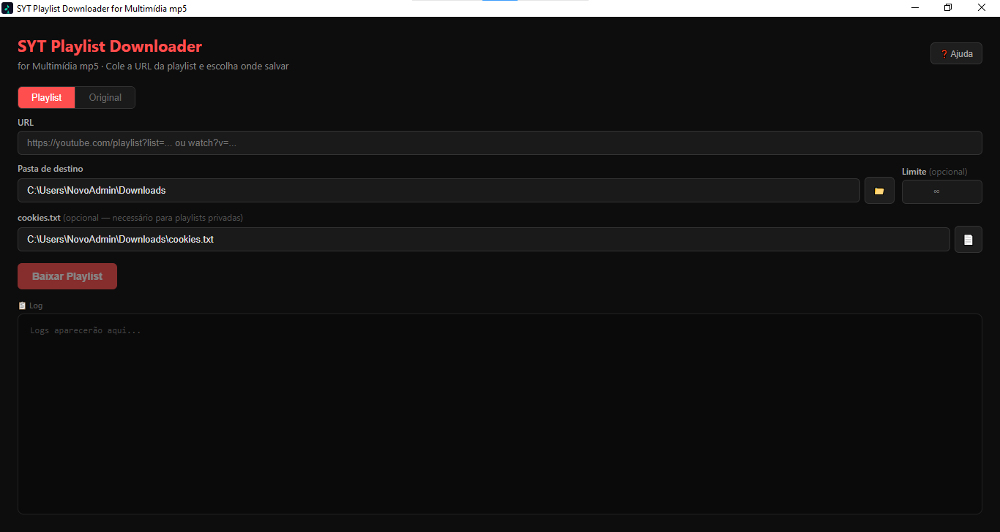
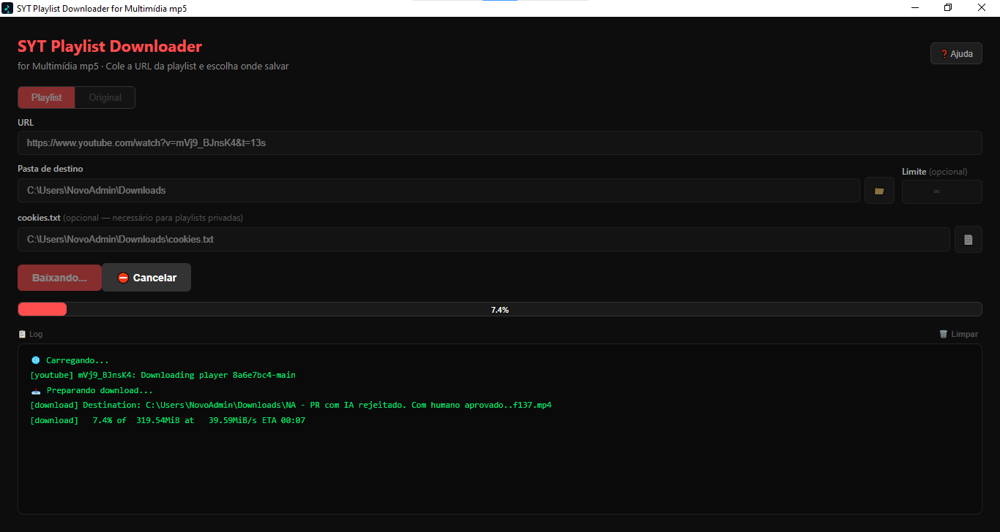
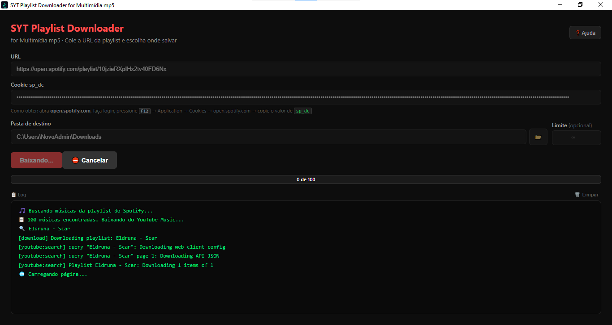

# SYT Playlist Downloader

> Aplicativo desktop para baixar playlists e vídeos do YouTube e músicas do Spotify — construído com Tauri, React e TypeScript.

## O que é?

O **SYT Playlist Downloader** é um app desktop leve e rápido para Windows que permite baixar:

- Playlists e vídeos do **YouTube** em alta qualidade (até 4K)
- Playlists do **Spotify** convertidas para MP3

A interface é simples — cole a URL, escolha a pasta e clique em baixar.

## Screenshots

  
  
  

## Funcionalidades principais

| Recurso | Descrição |
|---|---|
| **Playlist** | Baixa playlists do YouTube em MP4 1080p (H.264 + MP3), compatível com qualquer dispositivo |
| **Original** | Baixa em melhor qualidade disponível (4K, VP9, AV1), sem restrição de codec |
| **Spotify** | Busca as músicas da playlist no YouTube Music e baixa como MP3 de alta qualidade |
| **Auto-update** | Verifica e aplica atualizações automaticamente ao iniciar |
| **Cancelamento** | Cancela o download a qualquer momento com um clique |
| **Log em tempo real** | Acompanha o progresso de cada arquivo com barra e logs detalhados |

## Início rápido

1. [Instale as dependências](dependencias.md) (yt-dlp, ffmpeg, Node.js)
2. [Baixe o instalador](instalacao.md) na página de Releases
3. Abra o app, cole a URL e clique em **Baixar**

Veja o [guia completo de uso](como-usar.md) para mais detalhes.

## Stack tecnológica

| Camada | Tecnologia |
|---|---|
| Frontend | React + TypeScript + Vite |
| Backend | Rust (Tauri v2) |
| Empacotamento | Tauri (NSIS / MSI) |
| Download | yt-dlp + ffmpeg |
| API Spotify | REST API + cookie `sp_dc` |
